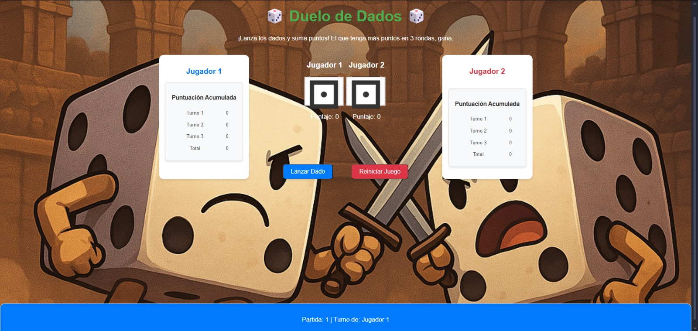
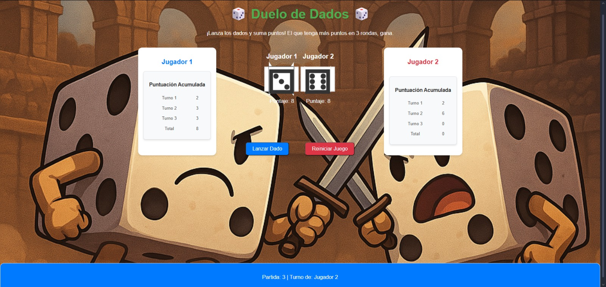
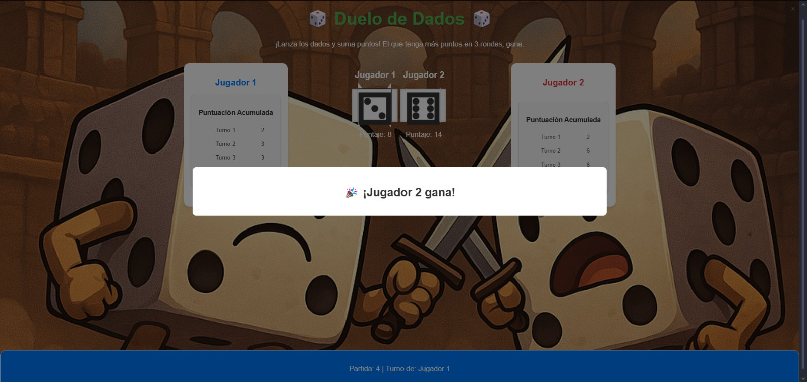

# 🎲 DUELO DE DADOS
Este es un duelo de dados desarrollado en HTML5(para la estructura de la página), CSS3(para el diseño y animaciones) y JavaScript(para la lógica del juego) como parte de la materia de Programacion y Plataformas Web por Sebastian Machado y Sebastian Verdugo.  
El objetivo del juego es que dos jugadores lancen un dado en tres rondas y el jugador con la mayor puntuación acumulada gana.

---------------------------------------------------------------------------------------------------------------------------------------------------

## INSTRUCCIONES
1. Presiona el botón "Lanzar dado" para tirar el dado.  
2. Los jugadores lanzan el dado alternadamente hasta completar tres rondas cada uno.  
3. Después de cada lanzamiento, la puntuación se suma automáticamente.  
4. Cuando ambos jugadores han lanzado tres veces, el juego muestra al GANADOR o si es un empate.
5. Oprimir tecla "Esc" para volver a la pantalla original del juego.  
6. Presiona el botón Reiniciar para jugar nuevamente.

---------------------------------------------------------------------------------------------------------------------------------------------------

## IMÁGENES DEL JUEGO

